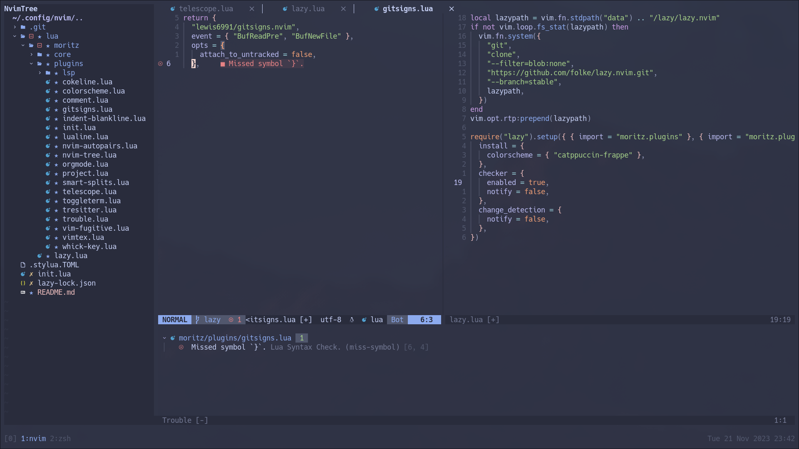

# My Neovim Configuration



This repository contains my personal Neovim configuration.

## Installation

1. **Clone this repository:**

   ```bash
   git clone https://github.com/morwald/nvim.git ~/.config/nvim
   ```
2. **Launch Neovim:**

Open Neovim by running nvim in your terminal. The plugin manager lazy.nvim will
automatically trigger the installation of plugins on the first launch.

## Features

- Organized configuration setup with [lazy.nvim](https://github.com/folke/lazy.nvim)
- Utilizes various plugins for enhanced functionality:
   - LSP integration with easy installation of servers, formatting, and linting:
      - [mason.nvim](https://github.com/williamboma/mason.nvim)
      - [lsp-zero.nvim](https://github.com/VonHeikemen/lsp-zero.nvim.git)
      - [none-ls.nvim](https://github.com/nvimtools/null-ls.nvim) (null-ls successor)
   - Syntax highlighting with [nvim-treesitter](https://github.com/nvim-treesitter/nvim-treesitter)
   - Convenient terminals with [toogleterm.nvim](https://github.com/akinsho/toggleterm.nvim)
   - A bufferline - [nvim-cokeline](https://github.com/willothy/nvim-cokeline.git).
   - Git integration through [vim-fugitive](https://github.com/tpope/vim-fugitive) and [gitsigns](https://github.com/lewis6991/gitsigns.nvim)
   - And more...
- Leader key-based keymaps
- Colorscheme: [catppuccin](https://github.com/catppuccin/nvim.git)
